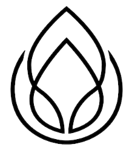

<!-- Improved compatibility of back to top link: See: https://github.com/Shahil9728/Calm/ -->
<a name="readme-top"></a>


<!-- PROJECT LOGO -->
<br />
<div align="center">
  <a href="https://github.com/Shahil9728/Calm">
    
  </a>

  <h3 align="center"><a href="https://calmyou.netlify.app" target="_blank">Calm</a></h3>
  <p align="center">
    <br />
    <br />
    <a href="https://github.com/Shahil9728/Calm/issues">Report Bug</a>
    ·
    <a href="https://github.com/Shahil9728/Calm/issues">Request Feature</a>
  </p>
</div>

### TutoTube

### Project Link: [https://calmyou.netlify.app](https://calmyou.netlify.app)
Must visit it for better view !🥰 

### Introduction

Calm is a music streaming platform designed to help you relax and fall asleep peacefully. With a wide variety of soothing music tracks, Calm is the ultimate solution for anyone looking to unwind and de-stress after a long day. Our platform is easy to use, with a simple and intuitive interface that allows you to browse and select your favorite tracks with ease. Our music is carefully crafted to promote relaxation and calmness, helping you to fall asleep faster and stay asleep longer. Our team of experienced developers is committed to providing you with the best possible experience, and we are always working to improve our platform and add new features. Give Calm a try and experience the benefits of a good night's sleep.

### Installation

## Step 1
Clone the Github Repository
```shell
git clone https://github.com/Shahil9728/Calm
```

## Step 2
And write start the local server
```shell
npm run start
```


<!-- IMAGES -->
### WEBSITe SCREENSHOTS


<br/>


### Built With

This section lists about the languages used in this project .

* 
* 
* 
* 


<br>

<p align="right">(<a href="#readme-top">back to top</a>)</p>

<!-- CONTACT -->
## Contact

Your Name - [@Shahil9728](https://twitter.com/Shahil9728) - shahilverma91383@gmail.com

Project Link: [https://calmyou.netlify.app/](https://calmyou.netlify.app/)

<p align="right">(<a href="#readme-top">back to top</a>)</p>


